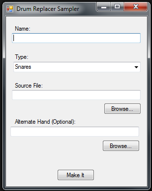

Cakewalk Drum Replacer SFZ Maker
=========

This utility simplifies the process of sampling drum synths for use with Cakewalk Drum Replacer. It digests a string of hits in a 24bit wave file and installs them to the Drum Replacer content locations in the correct format. 32 velocity levels are saved in the multisample. The source file should have 32 hits, crescendoing, separated by exactly 2 seconds each.

Steps:

1.  Open SONAR
2.  Set SONAR's tempo to 120
3.  Insert the drum instrument of your choice and choose the kit you'd like to sample
4.  Insert 32 MIDI notes at the start of each measure, increasing in velocity. They should play the kit piece that you want to sample.
5.  Export a 24bit 44.1kHz file
6.  (repeat if you want to randomize each hit with an alternative)

7.  Open the CwDrSfzMaker.exe utility
8.  Type in a name for your sample
9.  Specify a type
10. Click "Browse..." and locate the file you exported in step 4
11. Click "Make It"

At this point, you can instantiate Drum Replacer, navigate to the "User" section in the sample list, and locate your new content.
